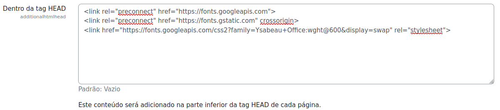
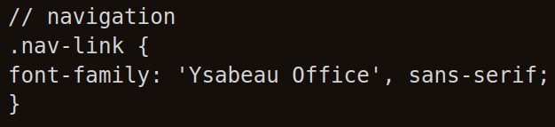

# Capacitação Moodle

Utilizamos a plataforma **Moodle** para formular a capacitação das voluntárias, dividindo por módulos.

Utilizamos o **Boost** como Plugin tema das nossas páginas e o arquivo de configuração mapa-default.css está dentro da pasta moodle-training desse repositório.

As configurações de estilização são feitas conforme descritas na documentação abaixo:

## Adicionar fonte do google fonts

1.1) Administração do site → Aparência → Código HTML adicional → **Dentro da tag HEAD** → adicionar link do google fonts. Exemplo:

1.2) Administração do site → Aparência → Temas → Boost (ou outro que estiver aplicado) → Configurações gerais → Arquivos de predefinição adicionais → adicionar o arquivo acrescentando as configurações desejadas. Exemplo de mudança do nome de fonte da navegação:

